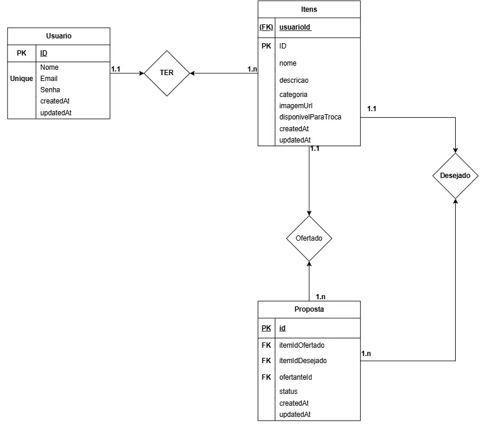

# 🏪 Feira de Trocas Comunitária - Backend

> **API REST para plataforma de trocas comunitárias** - Promovendo o consumo consciente e fortalecimento dos vínculos comunitários.

[](https://nodejs.org/)
[](https://expressjs.com/)
[](https://prisma.io/)
[](https://postgresql.org/)

## 📋 Sobre o Projeto

O **Feira de Trocas Comunitária** é uma API REST que permite moradores de uma comunidade trocarem itens em bom estado que não usam mais, como livros, roupas, brinquedos e ferramentas. A aplicação conecta pessoas interessadas em oferecer e receber objetos, promovendo o consumo consciente.

### 🎯 Objetivo

Desenvolver uma aplicação web que permita:

- Cadastro de itens para troca
- Visualização de itens disponíveis com filtros
- Realização de propostas de troca entre usuários
- Sistema de aceite/rejeição de propostas

---

## 🚀 Tecnologias Utilizadas

- **[Node.js](https://nodejs.org/)** - Runtime JavaScript
- **[Express.js](https://expressjs.com/)** - Framework web
- **[Prisma ORM](https://prisma.io/)** - Object-Relational Mapping
- **[PostgreSQL](https://postgresql.org/)** - Banco de dados relacional
- **[JWT](https://jwt.io/)** - Autenticação segura
- **[bcryptjs](https://www.npmjs.com/package/bcryptjs)** - Criptografia de senhas

---

## ⚡ Início Rápido

### 📋 Pré-requisitos

- **Node.js** (versão 16 ou superior)
- **PostgreSQL** (versão 12 ou superior)
- **npm** ou **yarn**
- **Git**

### 📥 Instalação

1. **Clone o repositório:**

   ```bash
   git clone git@github.com:MatheusQuintanilhaa/feira-trocas-backend.git
   cd feira-trocas-backend
   ```

2. **Instale as dependências:**

   ```bash
   npm install
   ```

3. **Configure as variáveis de ambiente:**

   ```bash
   # Copie o arquivo de exemplo
   cp .env.example .env

   # Edite o arquivo .env com suas configurações
   nano .env
   ```

4. **Configure o banco de dados:**

   ```bash
   # Execute as migrações
   npx prisma migrate dev

   # Gere o cliente Prisma
   npx prisma generate
   ```

5. **Inicie o servidor:**

   ```bash
   npm start
   ```

🎉 **Servidor rodando em:** `http://localhost:8080`

---

## 🔧 Funcionalidades

### 🏗️ Entidades do Sistema

| Entidade        | Descrição                                            |
| --------------- | ---------------------------------------------------- |
| **👤 Usuario**  | Representa quem utiliza a plataforma                 |
| **📦 Item**     | Representa os objetos disponibilizados para troca    |
| **🤝 Proposta** | Representa uma solicitação de troca entre dois itens |

### ⚙️ Principais Funcionalidades

- ✅ **Autenticação JWT** - Sistema seguro de login
- ✅ **CRUD Completo** - Criar, ler, atualizar e deletar itens
- ✅ **Filtros Avançados** - Por categoria, palavras-chave, disponibilidade
- ✅ **Sistema de Propostas** - Criação, aceite e rejeição de trocas
- ✅ **Controle Automático** - Gerenciamento de disponibilidade dos itens
- ✅ **Validações Robustas** - Garantia de integridade dos dados
- ✅ **Categorias Predefinidas** - Sistema organizado de classificação
- ✅ **Histórico de Atividades** - Acompanhamento de propostas

### 🔍 Categorias Disponíveis

- 📚 **Livros**
- 👕 **Roupas**
- 🧸 **Brinquedos**
- 📱 **Eletrônicos**
- 🔧 **Ferramentas**
- 🏠 **Casa e Jardim**
- ⚽ **Esportes**
- 🎵 **Música**
- 📂 **Outros**

---

## Endpoints da API

### Autenticação

#### Login

- **POST** `/login`
- **Body:**

```json
{
  "email": "usuario@email.com",
  "senha": "minhasenha"
}
```

- **Response:**

```json
{
  "id": "uuid",
  "nome": "Nome do Usuário",
  "email": "usuario@email.com",
  "isAdmin": false,
  "token": "jwt_token"
}
```

### Usuários

#### Criar Usuário

- **POST** `/users`
- **Body:**

```json
{
  "nome": "Nome do Usuário",
  "email": "usuario@email.com",
  "senha": "minhasenha",
  "isAdmin": false
}
```

#### Listar Usuários

- **GET** `/users` (requer autenticação)

#### Buscar Usuário por ID

- **GET** `/users/:id` (requer autenticação)

#### Atualizar Usuário

- **PUT** `/users/:id` (requer autenticação)

#### Deletar Usuário

- **DELETE** `/users/:id` (requer autenticação + admin)

### Itens

#### Criar Item

- **POST** `/items` (requer autenticação)
- **Body:**

```json
{
  "nome": "Bicicleta infantil azul",
  "descricao": "Bicicleta em ótimo estado, pouco uso",
  "categoria": "Brinquedos",
  "imagemUrl": "http://exemplo.com/imagem.jpg",
  "disponivelParaTroca": true
}
```

#### Listar Itens (com filtros)

- **GET** `/items` (requer autenticação)
- **Query parameters:**
  - `categoria`: Filtrar por categoria específica
  - `search`: Buscar por palavras-chave no nome ou descrição
  - `disponivelParaTroca`: true/false
  - `usuarioId`: Filtrar itens de um usuário específico

**Exemplos:**

- `GET /items?categoria=Livros`
- `GET /items?search=bicicleta`
- `GET /items?categoria=Roupas&disponivelParaTroca=true`

#### Listar Categorias

- **GET** `/items/categories`
- **Response:**

```json
["Livros", "Roupas", "Brinquedos", "Eletrônicos"]
```

#### Buscar Item por ID

- **GET** `/items/:id` (requer autenticação)

#### Atualizar Item

- **PUT** `/items/:id` (requer autenticação + ser o dono)

#### Deletar Item

- **DELETE** `/items/:id` (requer autenticação + ser o dono ou admin)

### Propostas

#### Criar Proposta

- **POST** `/proposals` (requer autenticação)
- **Body:**

```json
{
  "itemOfertadoId": "uuid_do_item_que_ofereço",
  "itemDesejadoId": "uuid_do_item_que_desejo"
}
```

#### Listar Propostas

- **GET** `/proposals` (requer autenticação)
- **Query parameters:**
  - `status`: pendente/aceita/rejeitada
  - `isMyProposal=true`: Apenas propostas do usuário logado

#### Buscar Proposta por ID

- **GET** `/proposals/:id` (requer autenticação)

#### Aceitar Proposta

- **PUT** `/proposals/:id/accept` (requer autenticação + ser o dono do item desejado)

#### Rejeitar Proposta

- **PUT** `/proposals/:id/reject` (requer autenticação + ser o dono do item desejado)

#### Deletar Proposta

- **DELETE** `/proposals/:id` (requer autenticação + ser o ofertante ou admin)

## Status Codes

- **200**: OK
- **201**: Created
- **204**: No Content
- **400**: Bad Request
- **401**: Unauthorized
- **403**: Forbidden
- **404**: Not Found
- **409**: Conflict
- **500**: Internal Server Error

## 🔐 Autenticação JWT

Todas as rotas protegidas requerem um token JWT no header:

```bash
Authorization: Bearer <token>
```

## 🗄️ Modelo de Dados

### 📊 Diagrama Entidade-Relacionamento (DER)

O diagrama abaixo representa a estrutura do banco de dados e os relacionamentos entre as entidades:



**Representação textual do diagrama:**

```text
┌─────────────┐           ┌─────────────┐           ┌─────────────┐
│   Usuario   │     1:N   │    Itens    │     1:N   │  Proposta   │
├─────────────┤   ────────┤─────────────┤───────────┤─────────────┤
│ id (PK)     │           │ id (PK)     │           │ id (PK)     │
│ nome        │           │ usuarioId   │◄──────────│ itemOfertado│
│ email       │◄──────────│ nome        │           │ itemDesejado│
│ senha       │           │ descricao   │           │ ofertanteId │
│ isAdmin     │           │ categoria   │           │ donoItemId  │
│ createdAt   │           │ imagemUrl   │           │ status      │
│ updatedAt   │           │ disponivel  │           │ createdAt   │
└─────────────┘           │ createdAt   │           │ updatedAt   │
                          │ updatedAt   │           └─────────────┘
                          └─────────────┘
                                 │
                                 │ 1:N
                                 ▼
                          ┌─────────────┐
                          │  Proposta   │
                          │ (item desej)│
                          └─────────────┘

Relacionamentos:
• Usuario (1) ──► Itens (N)     - Um usuário pode ter vários itens
• Itens (1) ──► Proposta (N)    - Um item pode estar em várias propostas
• Proposta ──► Item Ofertado    - Referência ao item oferecido
• Proposta ──► Item Desejado    - Referência ao item desejado
```

### 🔗 Explicação dos Relacionamentos

#### **1. Usuario ↔ Item (1:N)**

- **Relacionamento**: Um usuário pode **TER** vários itens
- **Cardinalidade**: 1 para N (um-para-muitos)
- **Chave Estrangeira**: `usuarioId` na tabela `Item`
- **Significado**: Cada item pertence a exatamente um usuário, mas um usuário pode cadastrar múltiplos itens para troca

#### **2. Item ↔ Proposta (1:N) - Item Ofertado**

- **Relacionamento**: Um item pode ser **OFERTADO** em várias propostas
- **Cardinalidade**: 1 para N
- **Chave Estrangeira**: `itemOfertadoId` na tabela `Proposta`
- **Significado**: O mesmo item pode ser oferecido em múltiplas propostas de troca

#### **3. Item ↔ Proposta (1:N) - Item Desejado**

- **Relacionamento**: Um item pode ser **DESEJADO** em várias propostas
- **Cardinalidade**: 1 para N
- **Chave Estrangeira**: `itemDesejadoId` na tabela `Proposta`
- **Significado**: O mesmo item pode ser desejado por diferentes usuários em suas propostas

### 🏗️ Estrutura Detalhada das Entidades

#### **👤 Usuario**

- **id** (UUID, PK) - Identificador único
- **nome** (String) - Nome completo do usuário
- **email** (String, unique) - E-mail único para login
- **senha** (String, hash) - Senha criptografada
- **isAdmin** (Boolean) - Permissão de administrador
- **createdAt, updatedAt** (DateTime) - Timestamps

#### **📦 Item**

- **id** (UUID, PK) - Identificador único
- **usuarioId** (String, FK) - Referência ao proprietário
- **nome** (String) - Nome do item
- **descricao** (String, optional) - Descrição detalhada
- **categoria** (String) - Categoria predefinida
- **imagemUrl** (String, optional) - URL da imagem
- **disponivelParaTroca** (Boolean) - Status de disponibilidade
- **createdAt, updatedAt** (DateTime) - Timestamps

#### **🤝 Proposta**

- **id** (UUID, PK) - Identificador único
- **itemOfertadoId** (String, FK) - Item que está sendo oferecido
- **itemDesejadoId** (String, FK) - Item que está sendo solicitado
- **ofertanteId** (String, FK) - Usuário que fez a proposta
- **donoItemDesejadoId** (String, FK) - Dono do item desejado
- **status** (String) - Estado da proposta: `pendente`, `aceita`, `rejeitada`
- **createdAt, updatedAt** (DateTime) - Timestamps

### 🔄 Fluxo de Negócio

1. **Cadastro**: Usuário se registra na plataforma
2. **Item**: Usuário cadastra itens que deseja trocar
3. **Busca**: Usuário navega pelos itens disponíveis
4. **Proposta**: Usuário propõe troca (oferece seu item por outro)
5. **Decisão**: Dono do item desejado aceita ou rejeita a proposta
6. **Finalização**: Itens ficam indisponíveis quando aceitos

---

## 🧪 Testando a API

### 🔑 1. Primeiro, crie um usuário

```bash
POST http://localhost:8080/users
Content-Type: application/json

{
  "nome": "Maria Silva",
  "email": "maria@exemplo.com",
  "senha": "123456"
}
```

### 🔐 2. Faça login para obter o token

```bash
POST http://localhost:8080/login
Content-Type: application/json

{
  "email": "maria@exemplo.com",
  "senha": "123456"
}
```

### 📦 3. Criar um item (use o token no header)

```bash
POST http://localhost:8080/items
Authorization: Bearer SEU_TOKEN_AQUI
Content-Type: application/json

{
  "nome": "Livro de JavaScript",
  "descricao": "Livro em ótimo estado sobre programação",
  "categoria": "Livros"
}
```

### 🔍 4. Listar itens com filtros

```bash
GET http://localhost:8080/items?categoria=Livros&search=JavaScript
Authorization: Bearer SEU_TOKEN_AQUI
```

---

## 📊 Scripts Disponíveis

| Script              | Comando                    | Descrição                   |
| ------------------- | -------------------------- | --------------------------- |
| **Desenvolvimento** | `npm start`                | Inicia servidor com nodemon |
| **Prisma Studio**   | `npx prisma studio`        | Interface visual do banco   |
| **Migrações**       | `npx prisma migrate dev`   | Executa migrações pendentes |
| **Gerar Cliente**   | `npx prisma generate`      | Gera o cliente Prisma       |
| **Reset DB**        | `npx prisma migrate reset` | Reseta o banco (cuidado!)   |

---

## 📁 Estrutura do Projeto

```javascript
feira-trocas-backend/
├── 📁 src/
│   ├── 📁 controllers/      # 🧠 Lógica de negócio
│   ├── 📁 middlewares/      # 🔒 Autenticação e autorização
│   ├── 📁 routes/           # 🛣️ Definição das rotas
│   ├── 📄 app.js           # ⚙️ Configuração do Express
│   └── 📄 db.js            # 🗄️ Configuração do Prisma
├── 📁 prisma/
│   ├── 📄 schema.prisma    # 🏗️ Schema do banco de dados
│   └── 📁 migrations/      # 🔄 Arquivos de migração
├── 📁 generated/           # 🤖 Cliente Prisma gerado
├── 📄 package.json         # 📦 Dependências do projeto
├── 📄 .env.example         # 🔧 Exemplo de configuração
└── 📄 README.md           # 📖 Documentação

```

---

## 🎓 Sobre o Projeto

### 📚 Contexto Acadêmico

Este projeto foi desenvolvido como parte do curso **Desenvolvimento Full Stack Básico - DFS-2025.2**.

### 🎯 Problema Resolvido

Em muitas comunidades, moradores acumulam itens em bom estado que não usam mais. Esses objetos poderiam ser reaproveitados se trocados entre os próprios vizinhos. Esta API resolve esse problema criando uma plataforma que conecta pessoas interessadas em trocar objetos.

### �‍💻 Desenvolvedor

- **Desenvolvedor**: Matheus Quintanilha
- **GitHub**: [@MatheusQuintanilhaa](https://github.com/MatheusQuintanilhaa)
- **Curso**: Desenvolvimento Full Stack Básico
- **Período**: 2025.2

---

## 🛡️ Status do Projeto

- ✅ **Backend Completo** - Todas as funcionalidades implementadas
- ✅ **Documentação** - README detalhado
- ✅ **Testes Manuais** - Endpoints validados
- ✅ **Estrutura Profissional** - Código organizado e comentado
- ⏳ **Frontend** - A ser desenvolvido

---
